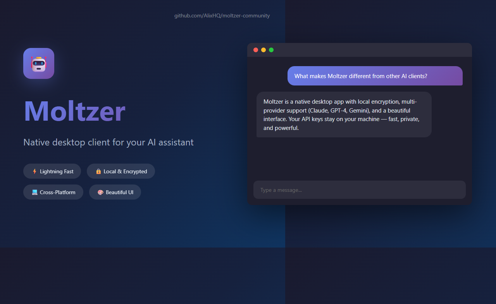

<div align="center">
  
# ?? Moltzer

**A native, lightweight desktop client for Clawdbot**

ChatGPT-style interface for your personal AI assistant, built with Tauri for true native performance

[](https://github.com/AlixHQ/moltzer-community/actions/workflows/ci.yml)
[](https://github.com/AlixHQ/moltzer-community/actions/workflows/release.yml)
[](https://opensource.org/licenses/MIT)
[](https://github.com/AlixHQ/moltzer-community/releases)
[](https://tauri.app/)
[](https://github.com/AlixHQ/moltzer-community/releases/latest)



[Download](https://github.com/AlixHQ/moltzer-community/releases) � [Quick Start](#-quick-start) � [Features](#-features) � [Documentation](./SETUP.md) � [Contributing](./CONTRIBUTING.md)

</div>

---

## ?? What is Moltzer?

Moltzer is a **native desktop application** that connects to your Clawdbot Gateway, providing a fast, beautiful interface for chatting with Claude and other AI models. Unlike browser-based or Electron apps, Moltzer uses your operating system's native webview, resulting in:

- **~10MB binary** (not 300MB like Electron!)
- **Minimal RAM usage** (~50MB vs 500MB)
- **Native look & feel** on every platform
- **Secure credential storage** via OS keychain

Think of it as "ChatGPT for Clawdbot" � but better, because it's yours.

---

## ? Get Started in 60 Seconds

**Already have Clawdbot Gateway running?**

1. **[Download Moltzer](https://github.com/AlixHQ/moltzer-community/releases)** for your platform
2. **Launch the app** and enter your Gateway URL (usually `ws://localhost:18789`)
3. **Start chatting!** Press **?N** (Mac) or **Ctrl+N** (Windows/Linux) for a new conversation

**Need to install Clawdbot Gateway first?** See our [Setup Guide](./SETUP.md).

---

## ? Features

### ?? Performance
- **Lightning fast** � Native binary with zero bloat
- **Streaming responses** � See AI responses as they're generated in real-time
- **Instant search** � Full-text search across all conversations with highlighting
- **Smart caching** � Local IndexedDB storage for instant conversation loading

### ?? Conversations
- **Unlimited chat history** � All conversations stored locally with encryption
- **Pin important chats** � Keep your most-used conversations at the top
- **Auto-generated titles** � First message becomes the conversation title
- **Rich markdown** � Code blocks with syntax highlighting, tables, lists, and more

### ?? Security & Privacy
- **End-to-end encryption** � All conversations encrypted at rest using AES-GCM 256-bit
- **OS keychain integration** � Master keys stored securely in macOS Keychain, Windows Credential Manager, or Linux Secret Service
- **Zero cloud storage** � Your data never leaves your device
- **Secure WebSocket** � Automatic wss:// fallback for secure connections

### ?? User Experience
- **Dark/Light/System themes** — Automatically follows your OS preference
- **Keyboard shortcuts** — Navigate like a power user (see [Features](#keyboard-shortcuts))
- **Model picker** — Switch between Claude, GPT, Gemini, and more
- **Thinking mode** — Enable extended reasoning for complex tasks
- **Responsive design** — Works beautifully on any screen size

### 🚀 Native Experience
- **Global hotkey** — `Cmd+Shift+Space` (Mac) / `Ctrl+Shift+Space` (Windows) for instant Quick Ask
- **System tray icon** — Always accessible from menu bar, even when window is hidden
- **Native menus** — Full Mac/Windows menu bar with standard shortcuts
- **Spring animations** — Messages pop in with physics-based animations
- **User-friendly errors** — No more cryptic technical messages

### ?? Developer Features
- **TypeScript** � Full type safety throughout the codebase
- **React 18** � Modern React with hooks and concurrent rendering
- **Zustand** � Lightweight state management (no Redux complexity)
- **Dexie** � IndexedDB wrapper for powerful local storage
- **Tauri v2** � Rust-based framework for maximum performance and security

---

## ?? Installation

### Download Pre-built Binaries

**Windows:**
```powershell
# Download from GitHub Releases
# https://github.com/AlixHQ/moltzer-community/releases

# Or use winget (if published)
winget install Moltzer.Client
```

**macOS:**
```bash
# Download .dmg from GitHub Releases
# https://github.com/AlixHQ/moltzer-community/releases

# Or use Homebrew (if published)
brew install molt-client
```

**Linux:**
```bash
# Download .AppImage from GitHub Releases
# https://github.com/AlixHQ/moltzer-community/releases

# Make executable and run
chmod +x Moltzer-1.0.0.AppImage
./Moltzer-1.0.0.AppImage
```

### Build from Source

See [CONTRIBUTING.md](CONTRIBUTING.md) for detailed build instructions.

---

## ?? Quick Start

### Prerequisites

1. **Clawdbot Gateway** must be running
   - See [SETUP.md](SETUP.md) for detailed installation guide
   - Default: `ws://localhost:18789`

2. **Authentication token** (if required)
   - Check your Gateway config
   - Run `clawdbot gateway status` to verify

### First Launch

1. **Launch Moltzer** � The app will guide you through initial setup

2. **Configure Gateway connection:**
   - Enter Gateway URL (e.g., `ws://localhost:18789`)
   - Enter auth token (if your Gateway requires it)
   - Click "Test Connection" to verify
   
3. **Start chatting!**
   - Press **?N** (Mac) or **Ctrl+N** (Windows/Linux) to create a new conversation
   - Type your message and press **Enter**

### First Message

Try something like:
```text
Hello! Can you explain what Moltzer is and what you can help me with?
```

Moltzer will connect to your Clawdbot Gateway and stream Claude's response in real-time.

---

## ?? Configuration

### Gateway Connection

**Open Settings:** Press **?,** (Mac) or **Ctrl+,** (Windows/Linux)

- **Gateway URL:** WebSocket endpoint for your Clawdbot Gateway
  - Format: `ws://hostname:port` or `wss://hostname:port`
  - Default: `ws://localhost:18789`
  - Auto-fallback: If `ws://` fails, Moltzer tries `wss://` automatically
  
- **Auth Token:** Optional authentication token
  - Required if your Gateway has auth enabled
  - Stored securely in OS keychain
  - Get from `~/.config/clawdbot/clawdbot.json` or your Gateway admin

### Chat Settings

- **Default Model:** Choose from available models (Claude, GPT, Gemini, etc.)
  - Models are fetched from your Gateway automatically
  - Falls back to common models if Gateway doesn't respond
  
- **Thinking Mode:** Enable extended reasoning by default
  - Useful for complex tasks requiring deeper analysis
  - Can be toggled per-conversation

### Appearance

- **Theme:** Light, Dark, or System (follows OS preference)

---

## ⌨️ Keyboard Shortcuts

### Global (System-wide)

| Shortcut | Action |
|----------|--------|
| **⌘⇧Space** / **Ctrl+Shift+Space** | Quick Ask (works from anywhere!) |

### In App

| Shortcut | Action |
|----------|--------|
| **⌘N** / **Ctrl+N** | New conversation |
| **⌘K** / **Ctrl+K** | Search messages |
| **⌘,** / **Ctrl+,** | Open settings |
| **⌘\\** / **Ctrl+\\** | Toggle sidebar |
| **⌘W** / **Ctrl+W** | Close conversation |

### Chat Input

| Shortcut | Action |
|----------|--------|
| **Enter** | Send message |
| **Shift+Enter** | New line |
| **Esc** | Clear input |

### Conversation List

| Shortcut | Action |
|----------|--------|
| **?** / **?** | Navigate conversations |
| **Enter** | Open conversation |
| **Delete** | Delete conversation |

---

## ??? Architecture

Moltzer is built with a modern, maintainable architecture:

```text
molt-client/
+-- src/                          # React frontend
�   +-- components/               # UI components
�   �   +-- ChatView.tsx         # Main chat interface
�   �   +-- Sidebar.tsx          # Conversation list
�   �   +-- MessageBubble.tsx    # Individual messages
�   �   +-- ChatInput.tsx        # Message input
�   �   +-- SettingsDialog.tsx   # Settings UI
�   �   +-- ui/                  # Reusable UI primitives
�   +-- stores/                  # Zustand state management
�   �   +-- store.ts            # Global app state
�   +-- lib/                     # Utilities & core logic
�   �   +-- db.ts               # IndexedDB (Dexie)
�   �   +-- encryption.ts       # AES-GCM encryption
�   �   +-- persistence.ts      # Data sync layer
�   +-- App.tsx                 # Root component
+-- src-tauri/                   # Rust backend
�   +-- src/
�   �   +-- lib.rs              # Tauri app setup
�   �   +-- gateway.rs          # WebSocket client
�   �   +-- keychain.rs         # OS credential storage
�   +-- Cargo.toml              # Rust dependencies
�   +-- tauri.conf.json         # Tauri configuration
+-- package.json                # Node dependencies
```

### Tech Stack

| Layer | Technology | Why? |
|-------|-----------|------|
| **Framework** | Tauri v2 | Rust-based, tiny binaries, native performance |
| **Frontend** | React 18 + TypeScript | Type-safe, modern, widely supported |
| **Styling** | Tailwind CSS | Utility-first, consistent design system |
| **State** | Zustand | Lightweight, no boilerplate, great DX |
| **Storage** | IndexedDB (Dexie) | Unlimited storage, full-text search |
| **Encryption** | Web Crypto API (AES-GCM) | Browser-native, battle-tested |
| **Keychain** | keyring-rs | Cross-platform OS credential storage |
| **WebSocket** | tokio-tungstenite | Async Rust WebSocket client |

---

## ?? Documentation

- **[SETUP.md](SETUP.md)** � Detailed setup guide (Gateway installation, troubleshooting)
- **[FEATURES.md](FEATURES.md)** � Complete feature documentation
- **[CONTRIBUTING.md](CONTRIBUTING.md)** � Developer guide (building, architecture, PRs)
- **[SECURITY.md](SECURITY.md)** � Security details (encryption, data storage)

---

## ?? Contributing

Contributions are welcome! Please read [CONTRIBUTING.md](CONTRIBUTING.md) for guidelines.

**Quick start for contributors:**

```bash
# Clone the repo
git clone https://github.com/AlixHQ/moltzer-community.git
cd molt-client

# Install dependencies
npm install

# Run in development mode
npm run tauri dev
```

---

## ??? Roadmap

- [x] Basic chat interface
- [x] Streaming responses
- [x] Conversation management
- [x] End-to-end encryption
- [x] Full-text search
- [x] Multiple model support
- [x] Dark/light themes
- [x] Keyboard shortcuts
- [ ] Voice input/output
- [ ] Image attachments
- [ ] Export conversations (Markdown, PDF)
- [ ] Conversation sharing
- [ ] System tray integration
- [ ] Mobile apps (Tauri v2 mobile support)
- [ ] Plugins/extensions

---

## ?? Known Issues

- **File attachments:** UI exists but not yet functional (planned for v1.1)
- **Voice input:** Not yet implemented
- **Image generation:** Not yet supported

See [GitHub Issues](https://github.com/AlixHQ/moltzer-community/issues) for full list and workarounds.

---

## ?? Troubleshooting

### Connection Issues

**Problem:** "Cannot connect to Gateway" error

**Solutions:**
1. **Verify Gateway is running:**
   ```bash
   clawdbot gateway status
   ```
2. **Check Gateway URL:**
   - Default: `ws://localhost:18789`
   - If using HTTPS, try `wss://` instead of `ws://`
3. **Check firewall:**
   - Ensure port 18789 is not blocked
   - Add exception for Moltzer and clawdbot

**Problem:** Connection drops frequently

**Solutions:**
1. Check network stability
2. Increase timeout in Gateway config
3. Use `wss://` for more reliable connections

### Performance Issues

**Problem:** App feels slow or laggy

**Solutions:**
1. **Clear local database:**
   - Settings ? Advanced ? Clear Cache
   - Warning: This deletes all conversations
2. **Check resource usage:**
   - Open Task Manager/Activity Monitor
   - If using >500MB RAM, file a bug report
3. **Update to latest version:**
   - Check [Releases](https://github.com/AlixHQ/moltzer-community/releases)

### Encryption Issues

**Problem:** "Cannot decrypt conversation" error

**Solutions:**
1. **Master key may have changed:**
   - Check OS keychain/credential manager
   - If key is missing, conversations cannot be recovered
2. **Fresh start:**
   - Export important conversations first
   - Settings ? Advanced ? Reset Encryption Keys

### Platform-Specific Issues

**macOS:**
- **App won't open:** Right-click ? Open (to bypass Gatekeeper)
- **Frozen UI:** Update to latest version (known issue on macOS 13)

**Windows:**
- **SmartScreen warning:** Click "More info" ? "Run anyway"
- **WebView2 missing:** Download from [Microsoft](https://go.microsoft.com/fwlink/p/?LinkId=2124703)

**Linux:**
- **AppImage won't run:** `chmod +x Moltzer-*.AppImage`
- **Missing dependencies:** Install `webkit2gtk` and `libayatana-appindicator3`

### Data & Storage

**Problem:** Conversations disappeared

**Solutions:**
1. **Check if database is intact:**
   - Developer Tools (F12) ? Application ? IndexedDB ? MoltDB
2. **Check encryption keys:**
   - Settings ? Security ? Verify Master Key
3. **Restore from backup** (if you have one):
   - Settings ? Import/Export ? Import Backup

**Problem:** App uses too much disk space

**Solutions:**
1. **Delete old conversations:**
   - Conversations are stored locally forever by default
2. **Clear search index:**
   - Settings ? Advanced ? Rebuild Search Index

### Still Having Issues?

1. **Check logs:**
   - macOS: `~/Library/Logs/Moltzer/`
   - Windows: `%APPDATA%\Moltzer\logs\`
   - Linux: `~/.local/share/Moltzer/logs/`

2. **Report a bug:**
   - [Open an issue](https://github.com/AlixHQ/moltzer-community/issues/new/choose)
   - Include: OS version, Moltzer version, error messages, logs

3. **Get help:**
   - [GitHub Discussions](https://github.com/AlixHQ/moltzer-community/discussions)
   - Email: support@moltzer.dev

---

## ?? License

MIT License � see [LICENSE](LICENSE) for details.

---

## ?? Acknowledgments

- **[Clawdbot](https://github.com/clawdbot/clawdbot)** � The AI gateway powering Moltzer
- **[Tauri](https://tauri.app/)** � Making native apps lightweight again
- **[Anthropic](https://anthropic.com/)** � Claude API
- The open source community

---

## ?? Support

- **Issues:** [GitHub Issues](https://github.com/AlixHQ/moltzer-community/issues)
- **Discussions:** [GitHub Discussions](https://github.com/AlixHQ/moltzer-community/discussions)
- **Email:** support@moltzer.dev

---

<div align="center">
  <p>Made with ?? by the Moltzer Community</p>
  <p>
    <a href="https://github.com/AlixHQ/moltzer-community">GitHub</a> �
    <a href="https://moltzer.dev">Website</a> �
    <a href="https://twitter.com/Moltzerclient">Twitter</a>
  </p>
</div>
